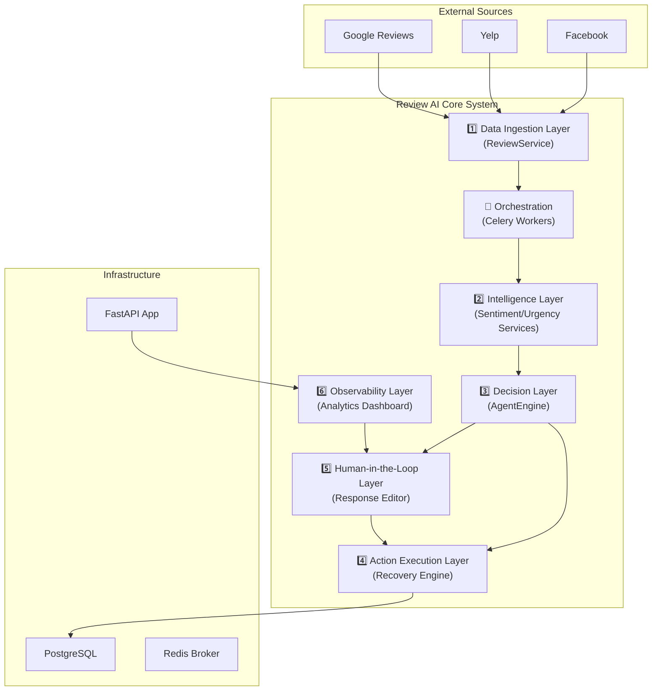

# Review AI — Autonomous AI Agent for Reputation Management

## Complete Architecture & Interview Preparation Guide

---

## 1. Project Overview

**Review AI** (formerly Revive AI) is a **production-ready, AI-powered system** designed for **SaaS platforms and service businesses** to autonomously monitor public reviews, analyze customer sentiment, and automate recovery actions. It continuously ingests review data, detects negative customer sentiment, generates context-aware responses using LLMs, and executes corrective recovery actions with built-in human oversight.

> [!IMPORTANT]
> Think of Review AI as an **autonomous virtual reputation manager** that runs 24/7 — ingesting site reviews, spotting churn risks, deciding on recovery strategies, and managing the business's public face.

### Key Business Value

| Metric | What It Measures |
|--------|-----------------|
| **% of negative reviews recovered** | Success rate in converting detractors back to promoters |
| **Average response velocity** | How much faster the business responds to critical threats |
| **Reduction in support burden** | Hours saved by automating routine review moderation |
| **Sentiment trend improvement** | Quantifiable growth in customer satisfaction over time |

### Tech Stack Summary

| Layer | Technology |
|-------|-----------|
| **API Framework** | FastAPI (Python 3.13) |
| **Frontend Framework** | Next.js 14 (React), TypeScript |
| **Data Validation** | Pydantic v2 & Zod |
| **AI / LLM Integration** | Mistral AI (Primary), OpenAI, Google Gemini |
| **Async Task Queue** | Celery + Redis (via Upstash) |
| **Database** | PostgreSQL (via Supabase) + SQLAlchemy (ORM) |
| **Styling** | Tailwind CSS + Lucide React |
| **Visualization** | Recharts (Responsive Analytics) |
| **Testing** | pytest (Backend) + npm test (Frontend) |

---

## 2. High-Level Architecture



### The 6-Layer Architecture

| # | Layer | Responsibility | Key Modules |
|---|-------|---------------|-------------|
| 1 | **Data Ingestion** | Collects, normalizes, and validates review data from multiple sources | [review_service.py](file:///c:/Users/Atharva/Documents/AI_REVIEW_AGENT/backend/app/services/review_service.py), [ReviewPlatform](file:///c:/Users/Atharva/Documents/AI_REVIEW_AGENT/backend/app/models/review.py#L13-L21) |
| 2 | **Intelligence Layer** | Analyzes text for sentiment, urgency, and category using LLM prompts | [sentiment_service.py](file:///c:/Users/Atharva/Documents/AI_REVIEW_AGENT/backend/app/services/sentiment_service.py), [urgency_service.py](file:///c:/Users/Atharva/Documents/AI_REVIEW_AGENT/backend/app/services/urgency_service.py) |
| 3 | **Decision Engine** | Orchestrates analysis and classifies actions (Auto-respond vs. Escalate) | [agent_engine.py](file:///c:/Users/Atharva/Documents/AI_REVIEW_AGENT/backend/app/services/agent_engine.py) |
| 4 | **Action Execution** | Handles background processing of LLM calls and persists responses | [review_tasks.py](file:///c:/Users/Atharva/Documents/AI_REVIEW_AGENT/backend/app/tasks/review_tasks.py), [recovery_action.py](file:///c:/Users/Atharva/Documents/AI_REVIEW_AGENT/backend/app/models/recovery_action.py) |
| 5 | **Human-in-the-Loop** | Provides a UI for manual review, editing, and approval of AI responses | [review-response-editor.tsx](file:///c:/Users/Atharva/Documents/AI_REVIEW_AGENT/frontend/src/components/reviews/review-response-editor.tsx) |
| 6 | **Observability** | Real-time monitoring of sentiment trends and performance KPIs | [review-analytics-dashboard.tsx](file:///c:/Users/Atharva/Documents/AI_REVIEW_AGENT/frontend/src/components/reviews/review-analytics-dashboard.tsx), [metrics_collector.py](file:///c:/Users/Atharva/Documents/AI_REVIEW_AGENT/backend/app/services/realtime_metrics.py) |

---

## 3. Directory Structure

```
AI_REVIEW_AGENT/
├── backend/                    # FastAPI Backend
│   ├── app/
│   │   ├── api/               # API Router and Endpoints (v1)
│   │   ├── core/              # Security (JWT), Database Config, Middleware
│   │   ├── models/            # SQLAlchemy Database Models (Review, User, RecoveryAction)
│   │   ├── schemas/           # Pydantic Data Validation Models
│   │   ├── services/          # Core Business Logic (AgentEngine, ReviewService)
│   │   └── tasks/             # Celery Background Workers (review_tasks.py)
│   ├── alembic/               # Database Migration Scripts
│   ├── tests/                 # Backend Unit & Security Tests
│   └── .env                   # Environment Variables (Secrets, API Keys)
│
├── frontend/                   # Next.js Frontend
│   ├── src/
│   │   ├── app/               # Page Router (Dashboard, Settings, Auth)
│   │   ├── components/        # UI Components (ReviewList, Analytics, Dashboard)
│   │   ├── lib/               # API Client (Axios), Utils, Context Providers
│   │   └── types/             # TypeScript Type Definitions
│   └── package.json           # Frontend Dependencies and Scripts
│
└── docs/                      # Technical Documentation
```

---

## 4. Deep-Dive Layer Walkthrough

### 4.1 Intelligence & Decision Layer (`backend/app/services/`)

**Purpose:** This is the "brain" of the platform. It takes raw text and converts it into actionable insights.

- **[AgentEngine](file:///c:/Users/Atharva/Documents/AI_REVIEW_AGENT/backend/app/services/agent_engine.py):** Orchestrates a 3-step pipeline:
    1.  **Analyze Sentiment:** Returns a score from 0.0 to 1.0.
    2.  **Classify Urgency:** Determines if a review needs immediate attention (e.g., negative rating + key trigger words).
    3.  **Categorize Issues:** Tags the review as "Service", "Quality", "Billing", etc.
- **`process_review()`**: The main function that feeds results into the `DecisionRulesEngine` to determine if a review should be `AUTO_EXECUTABLE` or `APPROVAL_REQUIRED`.

### 4.2 Background Task Layer (`backend/app/tasks/`)

**Purpose:** Ensures the user experience remains fast by offloading heavy AI operations to workers.

- **[review_tasks.py](file:///c:/Users/Atharva/Documents/AI_REVIEW_AGENT/backend/app/tasks/review_tasks.py):**
    - **`ingest_review`**: Triggers the entire AI analysis pipeline from a background thread.
    - **`generate_review_response`**: Connects to Mistral AI/OpenAI to generate a personalized response using pre-defined brand voice prompts.
    - **Idempotency**: Prevents double-processing of the same review via unique platform IDs.

---

## 5. Domain Models (`backend/app/models/`)

### Key Entities

| Model | Value Proposition |
|-------|-------------------|
| **`Review`** | Stores rating, raw content, AI-generated sentiment scores, and current status (`PENDING`, `RESOLVED`, `ESCALATED`). |
| **`RecoveryAction`** | Tracks automated recovery attempts (Emails, Discount Offers) including success rates and response status. |
| **`AgentDecision`** | A permanent log of every AI decision, including the "reasoning" extracted from the LLM, used for debugging and refinement. |

---

## 6. Interview Preparation: Potential Questions & Answers

### Architecture & Design

**Q1: Explain the flow when a new review arrives.**
> "A review is ingested via the `ReviewService`. Instead of blocking the request, we enqueue a Celery task (`ingest_review`). The Celery worker picks it up, runs it through the `AgentEngine` which calls our AI services (Sentiment, Urgency, Category), and then updates the `Review` model in PostgreSQL. Finally, the user sees the analyzed review on their Next.js dashboard."

**Q2: Why use both FastAPI and Next.js?**
> "FastAPI is ideal for AI-intensive backends because it handles async I/O efficiently, which is critical for calling external LLM APIs. Next.js provides a robust framework for building highly interactive, responsive dashboards with SEO benefits and server-side rendering where needed."

**Q3: How do you handle LLM API latency?**
> "We never make LLM calls during the typical HTTP request/response cycle. All LLM interactions happen asynchronously inside Celery workers using Redis as a message broker. This ensures the frontend remains snappy while AI works in the background."

**Q4: How does the "Human-in-the-Loop" feature work?**
> "For any review categorized with 'High' urgency or 'Negative' sentiment, the `AgentEngine` flags it as `APPROVAL_REQUIRED`. In the `ReviewResponseEditor` component on the frontend, the user sees the AI-generated suggestion but must manually click 'Publish' or edit the text before it's sent to the customer."

### Technical Implementation

**Q5: How is multi-tenancy handled?**
> "The system uses **Logical Isolation**. Every table, including `Reviews` and `Users`, has an `organization_id` ForeignKey. Our custom `AccessControlContext` middleware ensures that users can only view or modify data belonging to their specific organization."

**Q6: What happens if the AI provider (Mistral/OpenAI) is down?**
> "We implement **Exponential Backoff** in our Celery tasks. If a 503 error occurs, the task retries after 60s, then 120s, etc. We also have mock-data fallbacks in the frontend to prevent UI breaks during development or service outages."

**Q7: Explain the security model.**
> "Security is multi-layered. We use **JWT** for stateless authentication, **SQLAlchemy** to prevent SQL Injection, and **Pydantic/Zod** for strict input validation. We also have manual 'Security Audits' documented in the repo covering XSS and CSRF protections."

**Q8: If traffic spikes 100x, where would the system break first?**
> "The first bottleneck would likely be the **PostgreSQL connection pool** or **LLM rate limits**. To scale, I would introduce `PgBouncer` for connection pooling and implement a **multi-provider fallback system** (switching from Mistral to OpenAI or Gemini when hitting rate limits)."

---

## 7. Quick Reference: Commands

```bash
# Backend Setup
cd backend
python -m venv venv
venv\Scripts\activate
pip install -r requirements.txt
uvicorn app.main:app --reload

# Frontend Setup
cd frontend
npm install
npm run dev

# Testing
cd backend
pytest tests/
```
